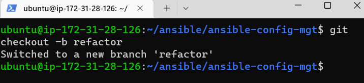
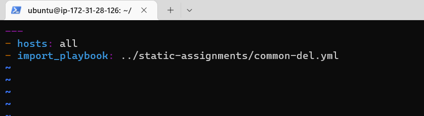
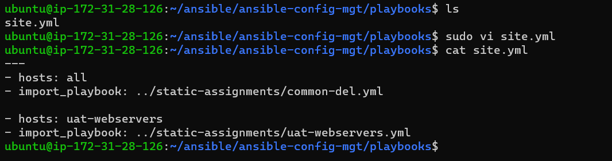

# Ansible refactoring and static assignments (imports and roles)

## Code Refactoring

Refactoring is a general term in computer programming. It means making changes to the source code without changing expected behaviour of the software. The main idea of refactoring is to enhance code readability, increase maintainability and extensibility, reduce complexity, add proper comments without affecting the logic.

## Jenkins job enhancement

Go to your Jenkins-Ansible server and create a new directory called `ansible-config-artifact` – we will store there all artifacts after each build. Change permissions to this directory, so Jenkins could save files there:

`sudo mkdir /home/ubuntu/ansible-config-artifact`
`chmod -R 0777 /home/ubuntu/ansible-config-artifact`

Go to Jenkins web console -> Manage Jenkins -> Manage Plugins -> on Available tab search for Copy Artifact and install this plugin without restarting Jenkins:

Create a new Freestyle project and name it save_artifacts. This project will be triggered by completion of your existing ansible project. Configure it accordingly:

Test your set up by making some change in README.MD file inside your ansible-config-mgt repository (right inside main branch). If both Jenkins jobs have completed one after another – you shall see your files inside /home/ubuntu/ansible-config-artifact directory and it will be updated with every commit to your main branch:

## Refactor Ansible code by importing other playbooks into site.yml

Pull down the latest code from main branch, and created a new branch, name it 'refactor'

Within playbooks folder, create a new file and name it `site.yml` – This file will now be considered as an entry point into the entire infrastructure configuration. Other playbooks will be included here as a reference. In other words, `site.yml` will become a parent to all other playbooks that will be developed. Including `common.yml` that was created previously.

Create a new folder in root of the repository and name it static-assignments. The static-assignments folder is where all other children playbooks will be stored. This is merely for easy organization of work. Move common.yml file into the newly created static-assignments folder:

Inside site.yml file, import common.yml playbook:

The folder structure should look like this:

Since it is required to apply some tasks to dev servers and wireshark is already installed – you can go ahead and create another playbook under `static-assignments` and name it `common-del.yml`. In this playbook, configure deletion of wireshark utility:

Update `site.yml` with `- import_playbook: ../static-assignments/common-del.yml` instead of `common.yml` and run it against dev servers:

Run `ansible-playbook` command against the `dev` environment:

`cd /home/ubuntu/ansible-config-mgt/`

`ansible-playbook -i inventory/dev.yml playbooks/site.yml`

There was an issue with one of the servers. fixed the issue and ran the playbook again:

Make sure that wireshark is deleted on all the servers by running `wireshark --version`:

## Configure UAT Webservers with a role ‘Webserver’

Launch 2 fresh EC2 instances using RHEL 8 image, we will use them as our uat servers, so give them names accordingly – Web1-UAT and Web2-UAT:

Use an Ansible utility called `ansible-galaxy` inside `ansible-config-mgt/roles` directory (you need to create roles directory upfront). Remove tests, files, and vars since we ansible-galaxy utility:

Update your inventory `ansible-config-mgt/inventory/uat.yml` file with IP addresses of your 2 UAT Web servers

In /etc/ansible/ansible.cfg file uncomment roles_path string and provide a full path to your roles directory roles_path = /home/ubuntu/ansible-config-mgt/roles, so Ansible could know where to find configured roles:

Time to start adding some logic to the webserver role. Go into tasks directory, and within the main.yml file, start writing configuration tasks to do the following:

1. Install and configure Apache (httpd service)

2. Clone Tooling website from GitHub https://github.com/kebsOps/tooling.git

3. Ensure the tooling website code is deployed to /var/www/html on each of 2 UAT Web servers.

4. Make sure httpd service is started

Your main.yml may consist of following tasks:

## Reference ‘Webserver’ role

Within the static-assignments folder, create a new assignment for uat-webservers `uat-webservers.yml`. This is where you will reference the role:

Remember that the entry point to our ansible configuration is the `site.yml` file. Therefore, you need to refer your `uat-webservers.yml` role inside `site.yml`

## Commit & Test

Commit changes, create a Pull Request and merge them to master branch, make sure webhook triggered two consequent Jenkins jobs, they ran successfully and copied all the files to your Jenkins-Ansible server into /home/ubuntu/ansible-config-mgt/ directory:

Note: make sure to create an access token on github so push is allowed since inputting password is no longer allowed

Confirm Jenkins job:

Now run the playbook against uat inventory and see what happens:

 `ansible-playbook -i /home/ubuntu/ansible-config-mgt/inventory/uat.yml /home/ubuntu/ansible-config-mgt/playbooks/site.yml`

 

 

 You should be able to see both of your UAT Web servers configured and you can try to reach them from your browser:

 `http://<Web1-UAT-Server-Public-IP-or-Public-DNS-Name>/index.php`

 

 Project done

